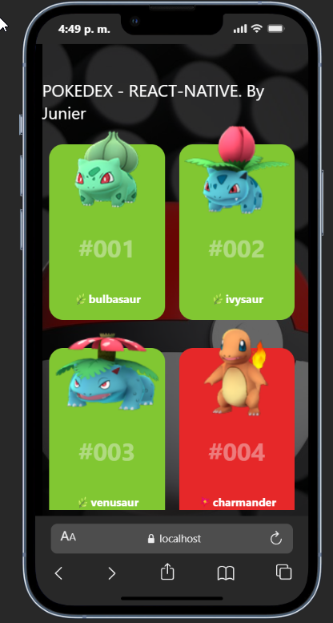
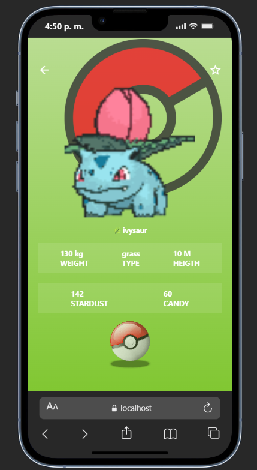
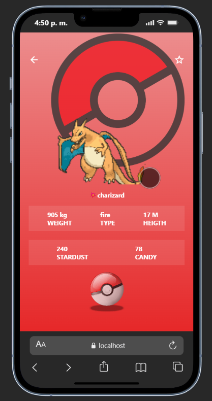

# Pokedex App (Expo)

Pokedex App es una aplicación móvil desarrollada con **Expo + React Native** que consume datos de la **PokeAPI**.

## 🧠 ¿Qué hace?

- Muestra una lista infinita de Pokémon (paginado) usando la API oficial de PokéAPI.
- Al tocar un Pokémon se muestra su detalle (peso, altura, tipo, stats, etc.).
- Usa `react-query` para caché y fetching eficiente.
- Navegación basada en [Expo Router](https://docs.expo.dev/router/introduction) con file-based routing.

## 🧩 Tecnologías clave

- **Expo** (React Native) - Base del proyecto
- **expo-router** - Enrutamiento basado en archivos
- **@tanstack/react-query** - Fetch, caché y estados de carga
- **axios** - Cliente HTTP
- **styled-components** - Estilos en JS
- **PokeAPI** (https://pokeapi.co/) - Fuente de datos

## 🌐 API utilizada

Esta app consume los siguientes endpoints de la PokeAPI:

- `https://pokeapi.co/api/v2/pokemon?limit=20` (lista paginada)
- `https://pokeapi.co/api/v2/pokemon/{id}` (detalles de cada Pokémon)

## 🚀 Cómo ejecutar

1. Instalar dependencias

```bash
npm install
```

2. Iniciar la app

```bash
npx expo start
```

3. Abrir en:

- Android emulator
- iOS simulator
- Expo Go (Android/iOS)

## 📸 Capturas de pantalla

> Nota: las imágenes están en `public/1.png`, `public/2.png`, `public/3.png`.







## 🎥 Video de demostración

> Video ubicado en `public/pokedex-app.mp4`

[Ver video en el navegador](public/pokedex-app.mp4)

---

## 📦 Estructura principal

- `app/` - Rutas y pantallas (Expo Router)
- `components/` - Componentes reutilizables (cards, UI)
- `assets/` - Imágenes y recursos
- `styles/` - Estilos globales

---

## 🧽 Reset del proyecto

Si quieres empezar desde cero:

```bash
npm run reset-project
```

Esto moverá el código actual a `app-example/` y generará un `app/` limpio.
